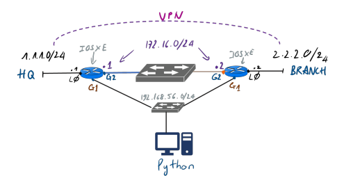
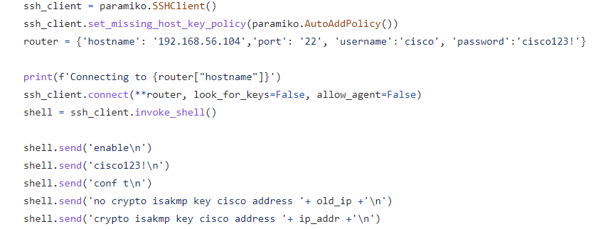
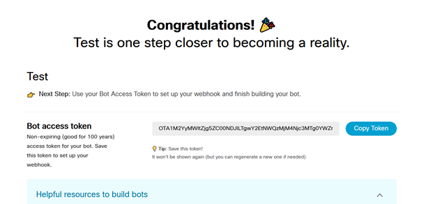
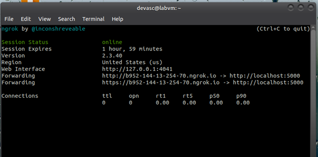
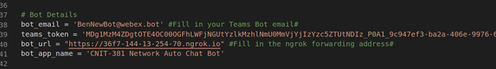
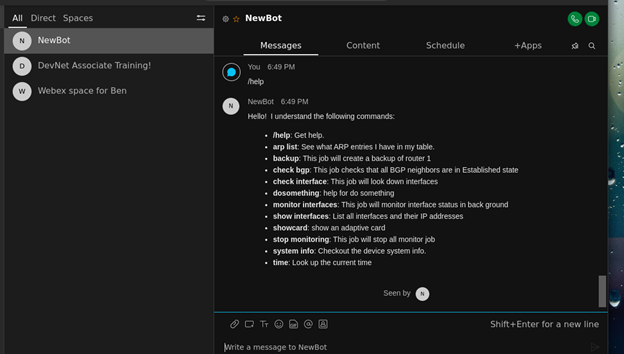

# 381 Final - Disaster Monitoring using Genie Bot

>This Image shows the topology we used to in our project, we used vitural CSRV1000 routers representing our Headquarters and Branch Routers. Ran the virtual machines on Virtual Box VM. Router 1 (HQ) and Router 2 (Branch), have a vpn connection allowing them access with eachother.

In the project we use multiple automation & programibility methods to monitor, configure and print, router configurations in our lab enviorment. We use methods such as RestConf, Paramiko, Ansible and Genie bot to achieve our goals. The main goal of the lab was to monitor g/2 interface on Router 2 (Branch) and check for a DHCP change of the ip on the interface. If an address change is detected, the bot monitoring the interface updates the old ip address in the vpn configuration on Router 1 (HQ), and removes the old vpn configuration.

### Parsing Branch Router Library

    url = "https://192.168.56.106/restconf/data/ietf-interfaces:interfaces/interface=GigabitEthernet2/ietf-ip:ipv4/address="
        
### Using Paramiko to re-configure HQ router VPN

          

>Note the removing of the previously configured VPN

### Multi-Threading
          
    th = threading.Thread(target=monitor_ip_job, args=(incoming_msg,))
    threads.append(th)  # appending the thread to the list
    # starting the threads
    for th in threads:
        th.start()
    # waiting for the threads to finish
    for th in threads:
        th.join()
        
>Threading was used to all multiple functions to be ran at once and allow for reaccuring monitoring of desired interfaces and devices

### Ansible Code:

For the ansible section of code we had to add this code to the 381Bot.py file.

This adds os commands to the code which we implemented shown below:

The code is then called to using this command shown below:

The ansible code that I used is shown below, the key parts of this is the show running config section
and the save which targets the backup folder.

### Paramkio Code:

For Paramiko we put everything in the 381Bot.py.

Import paramiko for the commands to be added shown below.

Paramiko also needs to know where it is going. These lines tell it the information of the router.

Below is the code that runs on the router to find the version.

This adds the commands "show version" to the list to call upon the code above.

## HOW-TO

**Installing Libraries:**
1.	On your Ubuntu system input the following commands, sudo snap install ngrok  ,  pip3 install webexteamssdk  ,  pip3 install webexteamsbot

**Creating a bot:**
1.	Go to https://developer.webex.com and click “Start Building Apps” create an account if you don’t have one already.
2.	Click “Create new app” and then “Create a Bot” 
3.	Enter your Bot’s name and a globally unique username (make sure to keep note of the username)
4.	Add Bot and then take note of the bot access token, we will need this for later.

5.	Navigate to https://teams.webex.com and sign in or create an account if you don’t have one.

**Create a Web Hook**

1.	Use command ngrok http 5000, you should get the following output

2.	Copy down the https forwarding address, we will need it for later

**Download Chat Bot Code**
1.	Navigate to https://github.com/Weberb6834/FinalLab and download the Network_Monitor file
2.	Open that folder in Visual Studio Code
3.	Open file 381Bot.py and navigate to Line 37, under bot details you will need to fill in your bot email, your bot token and for the bot_url enter in the ngrok https forwarding address

4.	Navigate to useless_skills.py and put in the token
5.	In routers.py use the IP of your CSR1000v address

**Run the bot**
1.	Run 381Bot.py with command python3 381Bot.py
2.	Navigate to either the Webex desktop app or the Webex web app
3.	If everything works you should be able to do the /help command and run any of the provided commands

